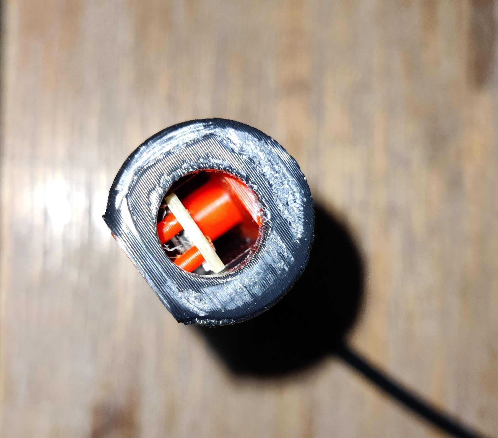

# Another OV5648 design for Angry CAM USB

# Camera Component Layout
There are various manufacturers of USB "stick cameras" like those for the OV5640 / OV5648 USB cameras. This repo contains CAD and STLs for fitting the layout of one of these:

# Hardware
- The AliExpress vendor link I used was (no affiliation): 
https://www.aliexpress.com/item/1005003833993617.html?spm=a2g0o.order_list.order_list_main.5.70ce1802KScJvA

# Models
The check the [CAD](CAD/) and [STL](STL/) folders for the Fusion360 design and the resulting STL model.

# Build
Printed version (in ABS) of the model.

Used default print settings, as per `#chri.kai.in`'s original [repo](https://github.com/VoronDesign/VoronUsers/tree/master/printer_mods/chri.kai.in/Angry_CAM_USB).

Side view showing clam fitment:

Here's the final assembly:

# Attribution
This is not a fork or modification of `#chri.kai.in`'s excellent Angry CAM USB Voron Printer MOD. It's just an additional set of CAD & STL models for one of the different camera stick component layouts out there.

All credit goes to `#chri.kai.in` and his repo over at https://github.com/VoronDesign/VoronUsers/tree/master/printer_mods/chri.kai.in/Angry_CAM_USB

