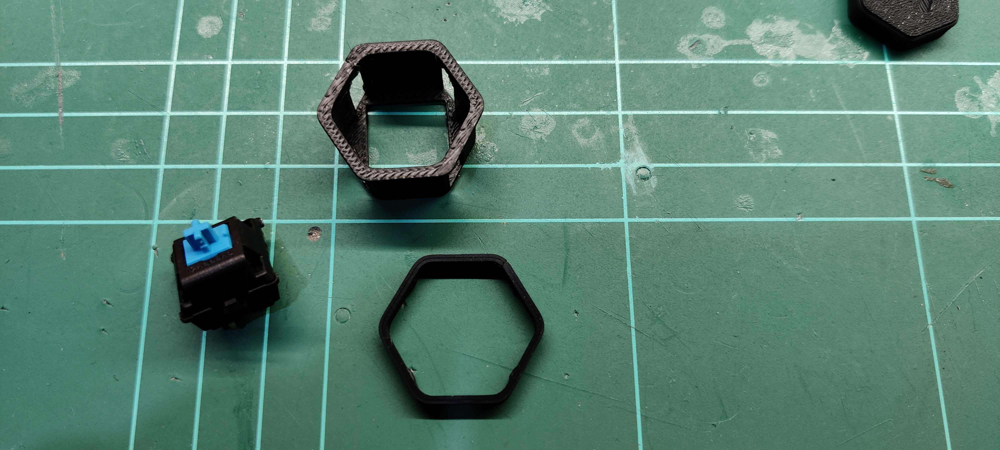
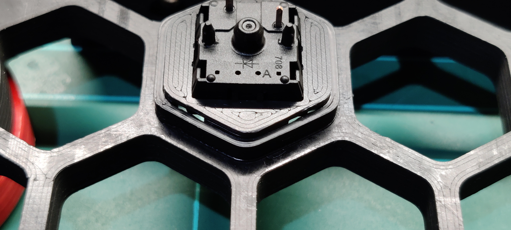
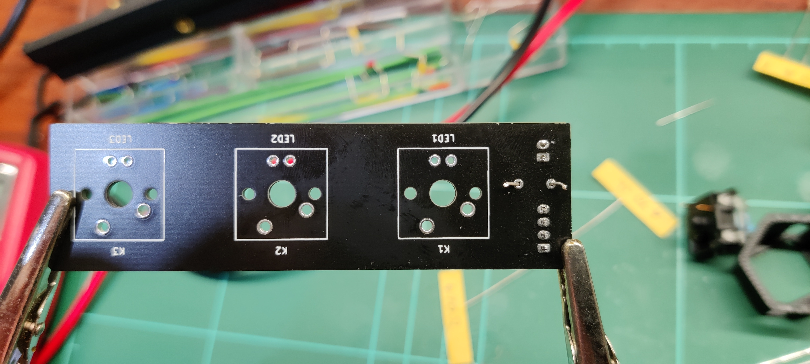
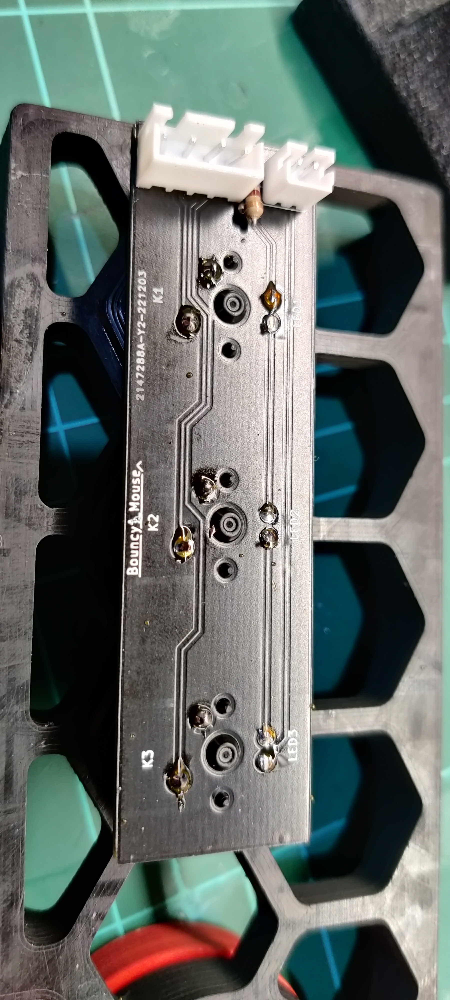
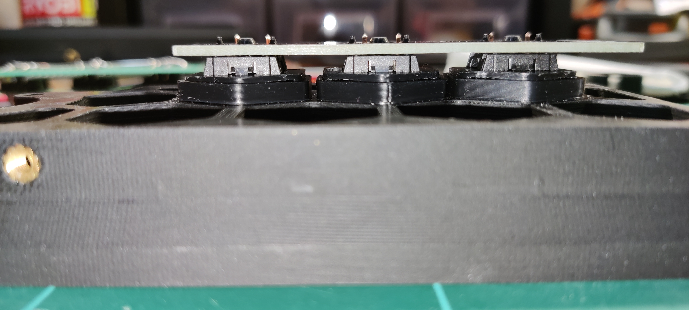
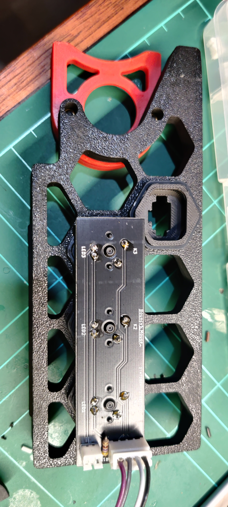
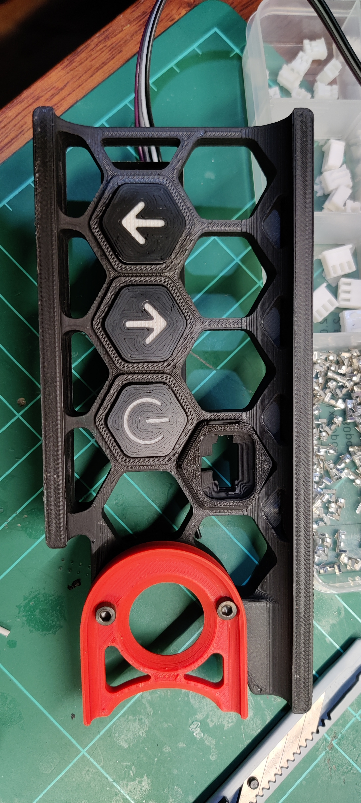
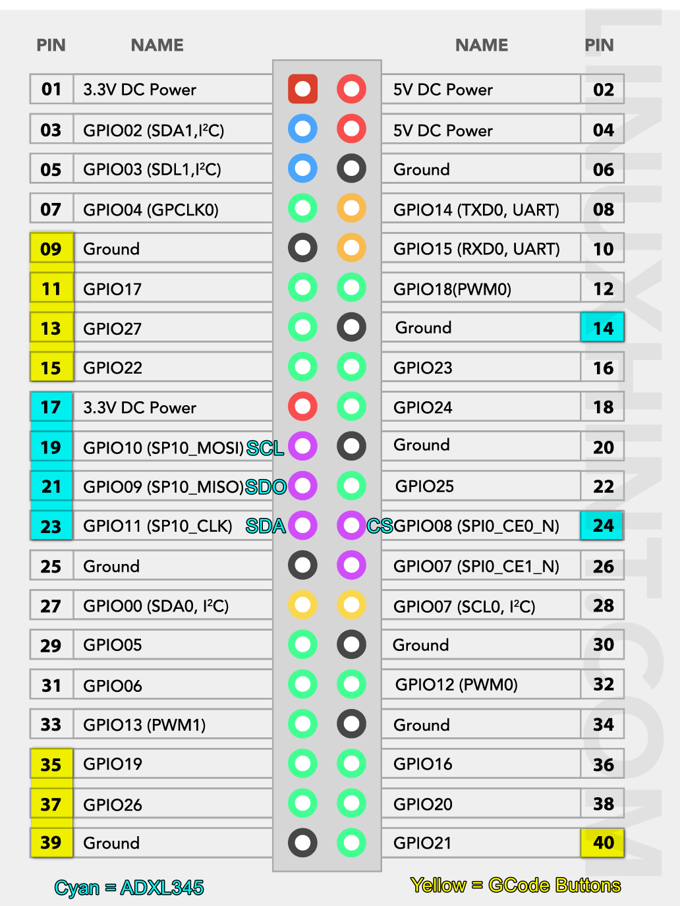
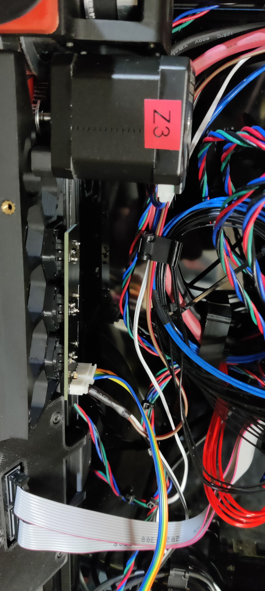
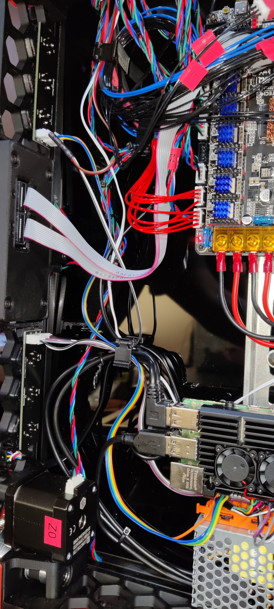

# Bouncy Mouse PCB for Voron skirt buttons
An evolution of the physical skirt button, by adding PCB to simplify wiring, soldering and physical mounting. 

  

### Credits and Attribution
This idea is not original or even novel, with most ideas taken from Voron user `meteyou`'s [gcode_buttons](https://github.com/VoronDesign/VoronUsers/blob/master/legacy_printers/printer_mods/README.md) and adapted to fit my needs after trial and error experiences.

Thanks to `meteyou` and everyone else who had some incarnation of skirt buttons for the Voron. Thanks to `MakerBogans` Australia 3D printer community for being friendly and supportive human beings.

## What are skirt buttons / G-Code buttons?
The idea is about having the convenience of direct interaction with physical buttons that perform a desired action upon pressing / releasing them. For example, pressing button `X` should instruct the print to turn on/off the internal LED light. (Insert your imagination here - mine sucks.)

The idea is not novel in any way and `Bouncy Mouse` is intended to help you build your own "custom" keyboard that can be installed in your Voron skirt, and then to connect that to your Raspberry PI / other GPIO interface and have it execute G-Code or macros.

Some users even replace / remove their display in favour of this.

Here's the `Bouncy Mouse` PCB (v1 is pictured):

Holds up to three CherryMX key switches (LED optional)

## Some known uses for G-Code buttons
- Pause / Resume an active print.
- Turn on/off/push-to-peek chamber LED lights.
- Turn on/off fans.
- Multi-material control (like ejecting filament in ERCF) 
- Start your Pre-heat / Warm-up routine
- Graceful shutdown of Printer Software (e.g. Klipper / Raspberry PI Operating System)
- Take a photo from printer CAM
- Home your printer

## Do I need Bouncy Mouse
No, you don't. You can use `meteyou`'s MOD and wire things directly - nothing wrong with it.

I created this because I found the soldering of wires to the switches and LEDs hard and fragile (I solder poorly - it's a hobby for me). I also held it all together much more firmly and regidly.

## How to build
I see it as 4 main stages:
1. __Print parts:__ Button shell, hexagon holder, key cap with icon.
2. __Physical build:__ Assemble PCB, Button, LED, Wires, Crimps, Solder, etc.
3. __GPIO PIN setup:__ I use a Raspberry PI 4B
4. __Klipper setup:__ What to do when GPIO pin has been triggered

### Stage 1 - Print parts
Look in the STL folder and print the following, 1 for each key:
* Hexagon Key Cap
* Hexagon Shell
* Hexagon Retention Clip (I'd print a few more incase they break)
If you are using 3 keys, then you need to print 3 of each.

*Note: Do yourself a favour now, and use a file or similar to smooth out any edges on the shell inner walls and key caps. If you don't you might get keys sticking.*

### Stage 2 - Physical Build
This link contains an [image from `meteyou`'s MOD](https://github.com/VoronDesign/VoronUsers/tree/master/legacy_printers/printer_mods/meteyou/gcode_buttons#how-to-build) that shows an exploded view on how the parts fit together.

#### A - Mate the Switch to the Shell
___
 `CherryMX key switch` fits into the `Hexagon Shell`. Take note of the orientation of the switch and ensure all keyes have the same orientation. The Caps only fit 0 / 180 degrees orientation and cannot be used at 90 angle. So just make sure your keys are the same. 
Depending on how you mount the `Bouncy Mouse` PCB, you may need to slot them upside down (or at 180 degrees). 

#### B - Mate the Shell to the Skirt
___
The `Hexagon Shell` slides into the skirt hollow from the front (outside). 
The image below includes the retention clip already applied (from step C below).

#### C - Use retention clip to keep Shell in the Skirt
___
The `Hexagon Retention Clip` slides onto the shell from the back (inside) and holds it into place so it doesn't slide out. 
*Take note the orientation of this clip as it has little bumps/tabs that need to align with the slots/holes of the shell*

Here's the whole set front and back installed:

#### D - Install and Solder Resistor R1 and JST connectors
___
*Important to add the connector and resistor components to the PCB __before__ soldering the PCB to the buttons in step F below*

Insert the Resistor into R1 (polarity doesn't matter) and also the JST connectors:

Take note of the side of the PCB here - these components come through from the back of the PCB and are soldered on the front. 

If you are not using LED for backlighting, then you can skip adding the 2-pin JST connector for position J2

*While v2 of the PCB has slightly different spacing, populating the components are the same.*

View from front of PCB:

Now solder these pins down on the front (please ignore my crappy soldering skills).

#### E - Attach PCB to Skirt assembly
---
This was a snug fit but I didn't need to force it. Depending on your print accuracy you may need some patience - just don't bend the pins of the key switch, and avoid cracking the shells.

Here's a side on view (taken during test fit before soldering connectors):

#### F - Add LED (Optional)
___
*The LED is for backlighting of the `Hexagon Key Cap` and is optional.*
Insert the 3mm LED of your choice in from the front, through the Key Switch body:

Take note of the polarity of the LED and match with the polarity on the PCB (polarity symbols added to v2 PCB - not shown above).

#### G - Solder the sandwitch
___
This might be a good time to double check any polarity and whether you have already soldered in your JST connectors (J1/J2) and resistor (R1), __before__ soldering the switches and LEDs.

And from the front:

#### H - Install and wire
___
The connector J2 is exclusively to power the LEDs. They are independent and do __NOT__ share ground (GND) with the ground (GND) of the switches.

Pin 1 of connector J1 is the ground (GND) and is shared with each of the keys in parallel. This means you don't have to provide a separate ground for each key GPIO and also that not all key slots have to be used. You can populate just K1 or just K2 for example.

For my configuration I used the following GPIO pins from my Rasberry PI 4 that I had available. You may need to use different PINs - if so, remember to update the pin mappings - refer STAGE 3 and STAGE 4 below.

My left keyboard
- GPIO17
- GPIO27
- GPIO22

and my right keyboard
- GPIO19
- GPIO26
- GPIO21

The above are my choices - you can use different pins

*IMPORTANT: GPIOxx is __not__ the same as PINxx*
Refer image below

(Apologies to LinuxHint.com who owns the original image - this is from my personal records - happy to attribute or remove if you want)

You can also go ahead an measure out some wire and crimp some JST connectors:

And installed in the frame:

Both installed!

#### I - Note about key LEDs and resistor R1
___
The LEDs are backlight to the keys and are optional. They are wired independently of the switches circuit, and connect in series.

The R1 resistor value of between 430-470ohm was selected based on having 3x 3mm LEDs populated and connected to a 12v supply (from BTT Octopus 1.1). 

If you use anything other than:
* 12v supply
* fewer / more than 3x LEDs
* non BOM components (like LEDs that do not have a forward voltage of around 1.6-1.8v)

  **then you need to adjust your R1 value accordingly**.

## Configure your Firmware
--------------------------------------------------------------------------------
Include the printer_buttons.cfg in your Klipper config.
If you use RRF, feel free to submit a config file for this mod. I don't use RRF so a cannot write a config file...

--------------------------------------------------------------------------------
Bill of Material
--------------------------------------------------------------------------------
- filament
- Cherry MX Buttons (my favorit type is the green version. hard respond with click sound)
- cables
- 3mm LEDs
- resistors

## Printing settings
---
- Nothing special. Using standard Voron part print settings should work fine.
- STLs were used to create ABS prints in the photos.
- Consider level of detail on buttons and changing colors for backlight to come through.

## Disclaimer
The advice and suggestions here are in good faith, and offer no warranty accepts no liability by any actions taken by you, in part or in full, from content in this repository.

If you wire or solder incorrectly, use the wrong polarity or voltage, or different resistor sizes then you can damage not only these components but also the connected devices like your MCU controller or GPIO device like Raspberry PI. Don't take on this project if you are not comfortable with holding yourself responsible. 

*Plain English: You acknowldge you are responsible for your actions and don't hold me liable for anything whatsoever.*