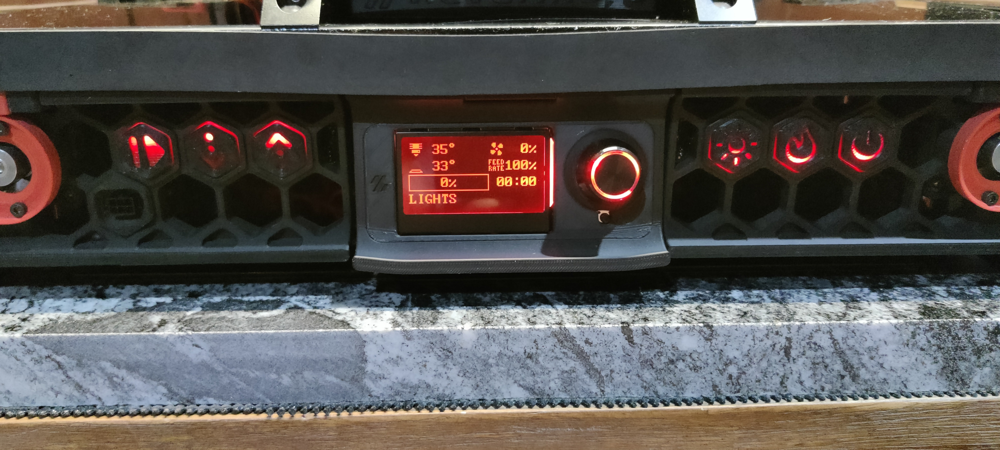
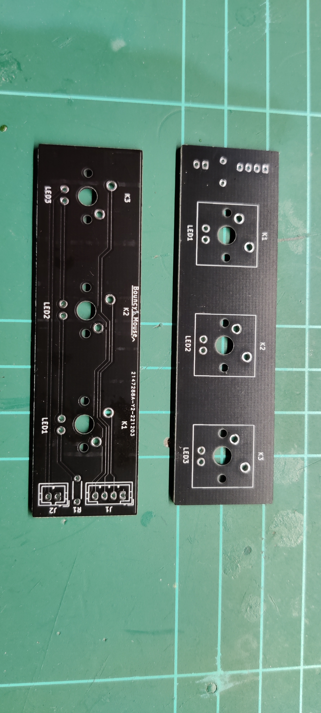
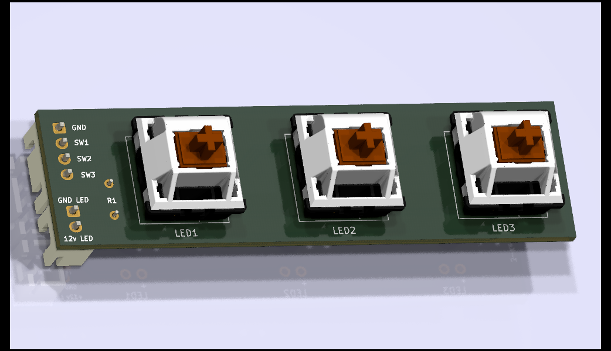
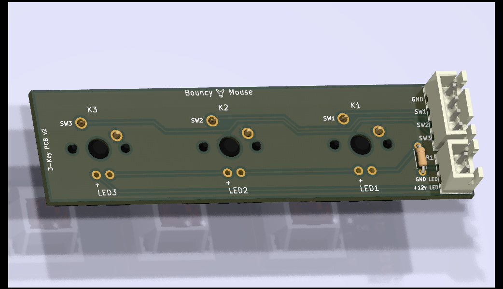
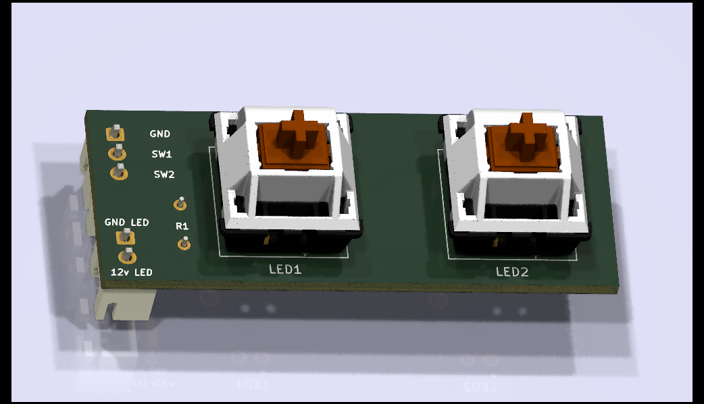
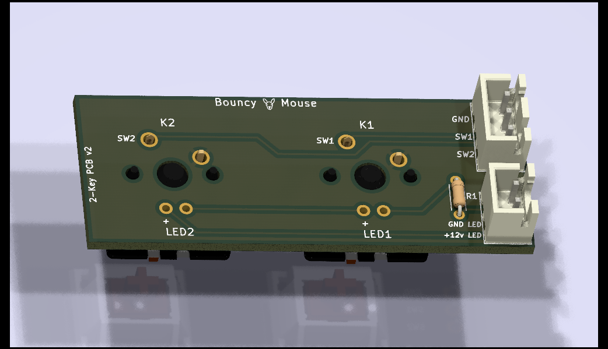
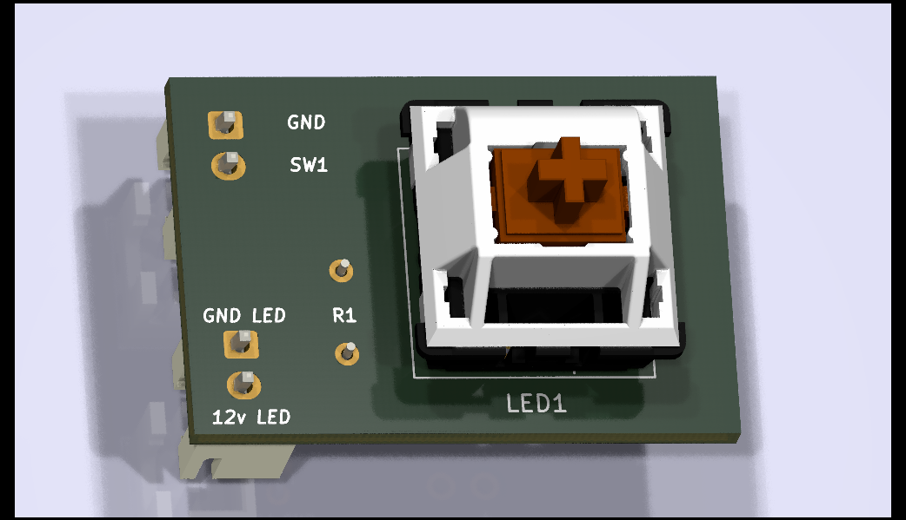
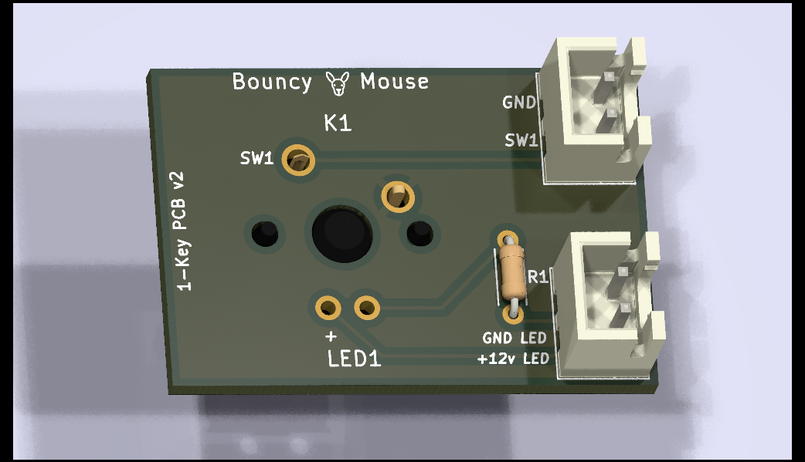

# Bouncy Mouse PCB for Voron skirt buttons
An evolution of the physical skirt button, by adding PCB to simplify wiring, soldering and physical mounting. 

  

## Credits and Attribution
This _mod_ is not original or even novel, with most concepts taken from Voron user `meteyou`'s [gcode_buttons](https://github.com/VoronDesign/VoronUsers/blob/master/legacy_printers/printer_mods/README.md) and adapted to fit my needs after trial and error experiences.

Thanks to `meteyou` and everyone else who had some incarnation of skirt buttons for the Voron. Thanks to `MakerBogans` Australia 3D printer community for being friendly and supportive human beings.

<br/>

# What are skirt buttons / G-Code buttons?
The idea is about having the convenience of direct interaction with physical buttons that perform a desired action upon pressing / releasing them. For example, pressing button `X` should instruct the print to turn on/off the internal LED light. (Insert your imagination here - mine sucks.)

The idea is not novel in any way and `Bouncy Mouse` is intended to help you build your own "custom" keyboard that can be installed in your Voron skirt, and then to connect that to your Raspberry PI / other GPIO interface and have it execute G-Code or macros.

Some users even replace / remove their display in favour of this.

Here's the `Bouncy Mouse` 3-Key PCB (v1 is pictured - v2 is current but with minor tweaks):


Holds up to three CherryMX key switches (LED optional)

## Some known uses for G-Code buttons
- Pause / Resume an active print.
- Turn on/off/push-to-peek chamber LED lights.
- Turn on/off fans.
- Multi-material control (like ejecting filament in ERCF) 
- Start your Pre-heat / Warm-up routine
- Graceful shutdown of Printer Software (e.g. Klipper / Raspberry PI Operating System)
- Take a photo from printer CAM
- Home your printer

<br/>

## Do I need Bouncy Mouse
No, you don't. You can use `meteyou`'s MOD and wire things directly - nothing wrong with it.

I created this because I found the soldering of wires to the switches and LEDs hard and fragile (I solder poorly - it's a hobby for me). Found the PCB held it all together much more firmly and rigidly.

<br/>


## Bill of Materials (BOM)
The hexagonal voids in the Voron skirts are the same size and spacing across the different Voron v2 size models (250mm vs. 300mm vs. 350mm) - there are just less or more voids (and thus keys).

### PCB Options
* `3`-Key PCB - Suitable for 350mm skirt / possibly even for 300mm skirt with PCB extending beyond behind the skirt)

    
    

* `2`-Key PCB - Suitable for 300mm skirt

    
    

* `1`-Key PCB - Suitable for 250mm skirt / small or custom usages

    
    


<br/>

### For each PCB, where `N` is the number of keys:
* `N`x CherryMX switches

* `N`x Printed part set
    * Hexagon Key Cap

    * Hexagon Key Shell

    * Hexagon Shell Retention Clip

* `N`+1 PIN JST XH through the hole / PCB mount receptacle (marked as J1 on PCB)

* `N`+1 PIN JST XH crimp connector housing

* `N`+1 PIN JST XH crimp connector female pin

* AWG 28 wiring long enough to reach connection points (recommend fitting length to size at point of installation)

<br/>

### Optional LEDs
The LED key backlight is optional. 

The LEDs require a current limiting resistor is required or you'll blow them. This is what R1 (marked on PCB) is for.
The Ohm size of R1 depends on your chosen configuration.

Key points to remember regarding R1:
* PowerSupply Voltage matters 12v vs. 24v.
* Number of LEDs matter.
* 12v is likely a minimum for 3 LEDs. 

A handy resource for calculating an appropriate value for R1 can be found [here](https://ledcalculator.net/#p=12&v=1.6&c=16&n=3&o=s). 
That link is pre-configured for 3 LEDs, a 12v Power Supply and typical 3mm Polulu LED forward voltages of 1.6v-1.8v.

If you are having difficulty getting these figured out, you are welcome to enquire with me (#Jaans) in the MakerBogans discord.


Here's the BOM for the LED portion of the PCB:
* 2 PIN JST XH through the hole / PCB mount receptacle (marked as J2 on PCB)

* 2 PIN JST XH crimp connector housing

* 2 PIN JST XH crimp connector female pin

* R1 - Resistor values


| Number of LEDs | Power Supply | LED forward voltage | LED current rating | R1            |
|:--------------:| ------------:| -------------------:| ------------------:| -------------:|
|               3|           12v|                 1.6v|                16mA|     430-470ohm|
|               2|           12v|                 1.6v|                16mA|     530-560ohm|
|               1|           12v|                 1.6v|                16mA|     640-680ohm|
| -              | -            | -                   | -                  | -             |
|               3|           24v|                 1.6v|                16mA|   1100-1200ohm|
|               2|           24v|                 1.6v|                16mA|   1200-1300ohm|
| -              | -            | -                   | -                  | -             |
|               1|            5v|                 1.6v|                16mA|     200-220ohm|

```
    Resistor ranges given (instead of absolute) to help use available 
    stock. Lower values will be more for brighter but also shorter life.

    I'm not an electronics engineer - so please validate the above for 
    yourself. Suggest you create a little test circuit to see if your 
    chosen LEDs and R1 value works. 
    
    Although this is generally safe should at worst only blow the LED, 
    bad things can happen - please refer to disclaimer section.
```
<br/>


## How to build
I see it as 4 main stages. 
Refer to each of the following pages for more detailed information:
1. [Print parts](./Stage1.md)

    Button shell, hexagon holder, key cap with icon.
    
    Click [here](./Stage1.md) to view page about this section.

    <br/>

2. [Physical build](./Stage2.md)
    
    Assemble PCB, Button, LED, Wires, Crimps, Solder, etc.
    
    Click [here](./Stage1.md) to view page about this section.

    <br/>

3. [GPIO PIN setup](./Stage3.md)

    I use a Raspberry PI 4B and configure pins as input with pull-up resistor enabled.

    Click [here](./Stage1.md) to view page about this section.

    <br/>

4. [Klipper setup](./Stage4.md)

    What to do when GPIO pin has been triggered.

    Click [here](./Stage1.md) to view page about this section.


<br/>


## Disclaimer
The advice and suggestions here are in good faith, and offer no warranty accepts no liability by any actions taken by you, in part or in full, from content in this repository.

If you wire or solder incorrectly, use the wrong polarity or voltage, or different resistor sizes then you can damage not only these components but also the connected devices like your MCU controller or GPIO device like Raspberry PI. Don't take on this project if you are not comfortable with holding yourself responsible. 

*Plain English: You acknowledge you are responsible for your actions and don't hold me liable for anything whatsoever.*