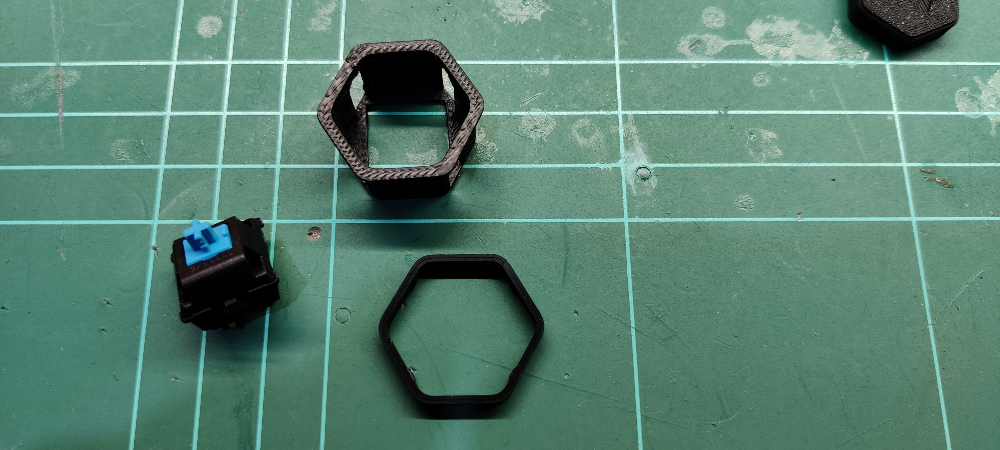

# Stage 1 - Print parts
Look in the STL folder and print the following, 1x for each key:
* Hexagon Key Cap

* Hexagon Shell

* Hexagon Retention Clip (I'd print a few more incase they break)

If you are using 3 keys, then you need to print 3 of each.

*Pro-tip: Do yourself a favour now, and use a file or similar to smooth out any edges on the shell inner walls and key caps. If you don't you might get keys sticking.*

## Print settings
- Nothing special. Using standard Voron part print settings should work fine.

- ABS used in the photos, but I suppose PLA should work too as its not a high temperature environment. I prefer not to use PLA (which degrades over time) for anything structural.

- Consider level of detail on buttons and changing colors for backlight to come through. I'll add some more key caps over time.

 

### Next - Stage 2 - Physical Build : Click [here](./Stage2.md)

 

### Back to HOME : Click [here](./README.md)