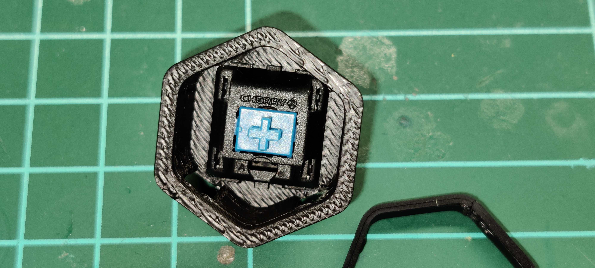

# Stage 2 - Physical Build
Click this link to see [image from `meteyou`'s MOD](https://github.com/VoronDesign/VoronUsers/tree/master/legacy_printers/printer_mods/meteyou/gcode_buttons#how-to-build) that shows an exploded view on how the parts fit together.

What follows are those steps combined with the PCB.

 

## A - Mate the Switch to the Shell
 `CherryMX key switch` fits into the `Hexagon Shell`. Take note of the orientation of the switch and ensure all keyes have the same orientation. The Caps only fit 0 / 180 degrees orientation and cannot be used at 90 angle. So just make sure your keys are the same. 
Depending on how you mount the `Bouncy Mouse` PCB, you may need to slot them upside down (or at 180 degrees). 

## B - Mate the Shell to the Skirt
The `Hexagon Shell` slides into the skirt hollow from the front (outside). 
The image below includes the retention clip already applied (from step C below).

## C - Use retention clip to keep Shell in the Skirt
The `Hexagon Retention Clip` slides onto the shell from the back (inside) and holds it into place so it doesn't slide out. 
*Take note the orientation of this clip as it has little bumps/tabs that need to align with the slots/holes of the shell*

Here's the whole set front and back installed:

## D - Install and Solder Resistor R1 and JST connectors
*Important to add the connector and resistor components to the PCB __before__ soldering the PCB to the buttons in step F below*

Insert the Resistor into R1 (polarity doesn't matter) and also the JST connectors:

Take note of the side of the PCB here - these components come through from the back of the PCB and are soldered on the front. 

If you are not using LED for backlighting, then you can skip adding the 2-pin JST connector for position J2

*While v2 of the PCB has slightly different spacing, populating the components are the same.*

View from front of PCB:

Now solder these pins down on the front (please ignore my crappy soldering skills).

## E - Attach PCB to Skirt assembly
This was a snug fit but I didn't need to force it. Depending on your print accuracy you may need some patience - just don't bend the pins of the key switch, and avoid cracking the shells.

Here's a side on view (taken during test fit before soldering connectors):

## F - Add LED (Optional)
*The LED is for backlighting of the `Hexagon Key Cap` and is optional.*
Insert the 3mm LED of your choice in from the front, through the Key Switch body:

Take note of the polarity of the LED and match with the polarity on the PCB (polarity symbols added to v2 PCB - not shown above).

## G - Solder the sandwitch
This might be a good time to double check any polarity and whether you have already soldered in your JST connectors (J1/J2) and resistor (R1), __before__ soldering the switches and LEDs.

And from the front:

## H - Install

Installed in the frame:

The connector J2 exclusively power the LEDs. They are independent and do __NOT__ share ground (GND) with the ground (GND) of the switches.

Pin 1 of connector J1 is the ground (GND) for the GPIO pins, and is shared with each of the keys in parallel. This means you don't have to provide a separate ground for each key GPIO and also that not all key slots have to be used. You can populate just K1 or just K2 for example.

## I - Important note about key LEDs and resistor R1
The LEDs are backlight to the key caps and are optional. They are wired independently of the switches circuit, and connect in series.

The R1 resistor value of between 430-470ohm was selected based on having 3x 3mm LEDs populated and connected to a 12v supply (from BTT Octopus 1.1). 

If you use anything other than:
* 12v supply
* fewer / more than 3x LEDs
* non BOM components (like LEDs that do not have a forward voltage of around 1.6v - 1.8v)

  **then you need to adjust your R1 value accordingly**.

 

### Next - Stage 3 - GPIO PIN setup : Click [here](./Stage3.md)

 

### Back to HOME : Click [here](./README.md)