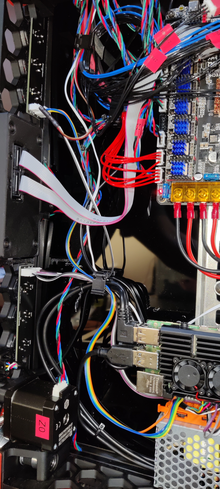
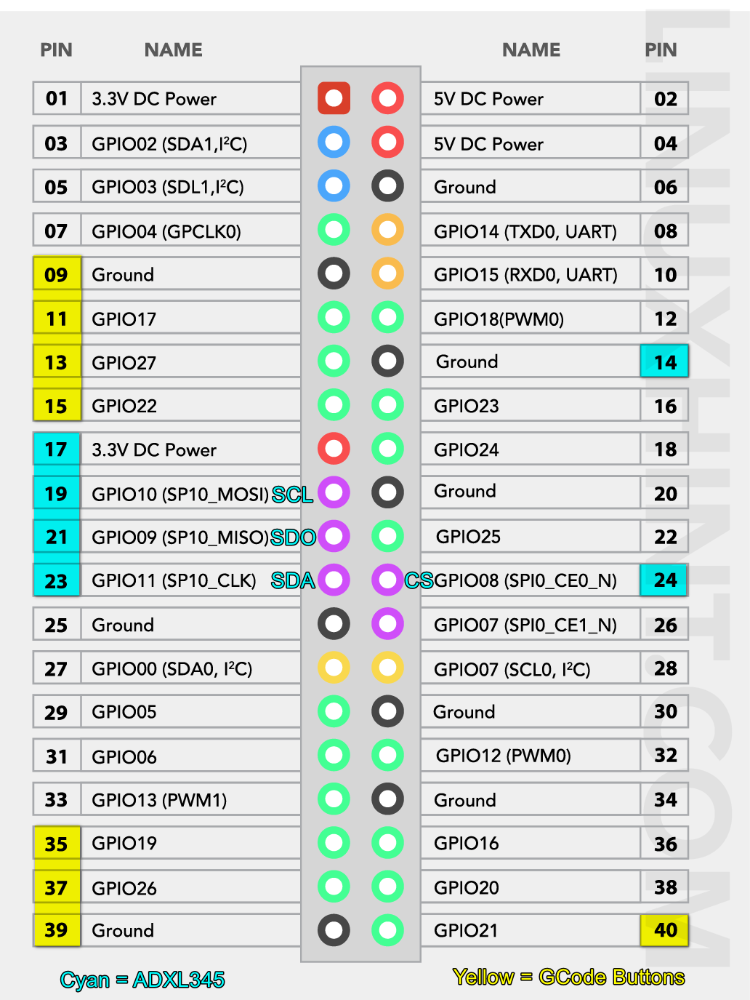
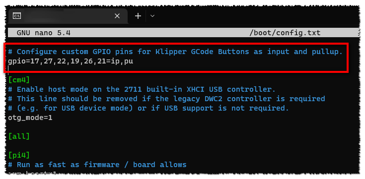

# Stage 3 - GPIO PIN setup

## Create JST crimped wires
You can also go ahead an measure out some wire lengths that fit your layout.
The number of wires will need to fit your selection of `N`-Key PCB and LEDs.

The one end of wire loom has the JST XH female pin connector crimped and connects to the PCB. 

I'm using my Raspberry PI for GPIO pins and so I chose to crimp Du-Pont style connectors on the other end to more easily connect to the PI headers.

 Both PCBs installed and wired up to PI:

## GPIO PIN selection
For my personal configuration I used the following GPIO pins from my Raspberry PI 4 (that I had available since I use an accelerometer). 

> You may need to use different PINs - if so, remember to update the pin mappings - refer further down below and STAGE 4.

My left keyboard:
- GPIO17
- GPIO27
- GPIO22

and my right keyboard:
- GPIO19
- GPIO26
- GPIO21

**IMPORTANT:** GPIOxx is __not__ the same as PINxx - refer image below. The yellow highlighted pins are for the GPIO buttons.

> Attribution: LinuxHint.com owns the original image

The above also shows which ground pins I used.

## Raspberry PI configuration
We need to tell the Raspberry PI that we want to use the above GPIO pins as INPUT pins (not the default), and also to enable the PULL-UP resistor so that when we close the circuit to ground via the PCB switch, the state can change and be detected.

This is pretty simple to do, but requires a but of Linux / Raspberry PI OS know how.

There should be a lot of additional resources available on how to edit / modify a file on the PI, so I won't rehash that here. You want to either SSH into your PI and use an editor to modify the file, or you could do so remotely via SCP tool like WinSCP (if you are on Windows).

What we want to do is edit the `/boot/config.txt` file to configure GPIO pins at startup:

This way the PIN configuration is retained after reboots of the PI.

_**Note:** Remember to adjust the GPIO pins referenced to match your selection._

 

### Next - Stage 4 - Klipper setup : Click [here](./Stage4.md)

 

### Back to HOME : Click [here](./README.md)