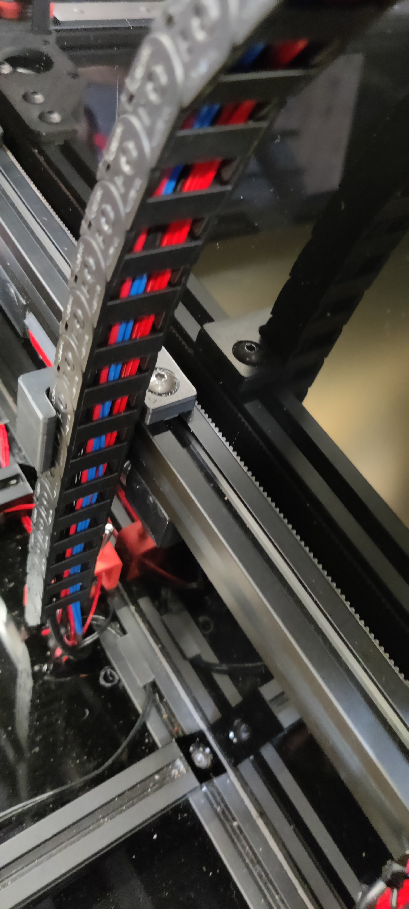
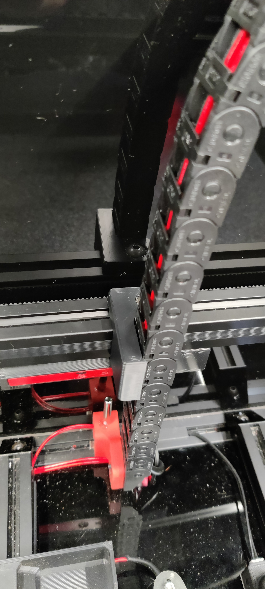

# Yet Another Chain Guide

I needed a chain guide I could put on the back gantry of my Voron v2.4 350mm to keep the drag chain from moving/folding over into the view of my gantry mounted camera.

Couldn't find what I needed, so modelled my own variation.

The CAD is included in this repository, so feel free to adjust it to your needs.

## Example 1

## Example 2
Here's another variation

# Models
The check the [CAD](CAD/) and [STL](STL/) folders for the Fusion360 design and the resulting STL model.

# Print Settings
Printed in ABS to cope with heat of chamber.
Used standard Voron ABS print guidance.
Part is already oriented in STL.
