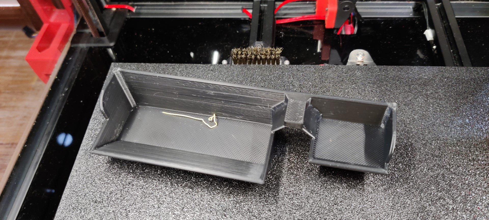

# Purge Bucket - Whopping Remix

These modifications are to fit my [Fermio Labs 350mmx350mm build plate](https://fermio.xyz/fermio-labs-gmbh/voron-build-plate-350-x-350-mm/) and [Whoppingpochard's Maxwell Kinematic mounts](https://uniqueprints.shop/shop/voron-2-4/voron-2-4-kinematic-bed-mount/) (Thanks @JACKT).

The CADs are shamefully adapted from the bucket design by [Dr. Dave](https://github.com/Dfdye/Voron_Mods/tree/main/Purge_Bucket_for_WP_Kinetic_Mount). 

For some reason his design didn't quite fit my setup anymore when I had to move things around a little to physically accommodate the Y offset induced by [Voron TAP](https://github.com/VoronDesign/Voron-Tap).

So, I modified them to fit.

# Models
Look in the [CAD](CAD/) and [STL](STL/) folders for the Fusion360 design and the resulting STL model.

# Build
Followed the original repo's guide.

### Printed in Polymaker PolyLite ABS.

### MAG-ed and Loaded!

# Attribution
All credit goes to `Dr. Dave` and his repo over at https://github.com/Dfdye/Voron_Mods/tree/main/Purge_Bucket_for_WP_Kinetic_Mount
