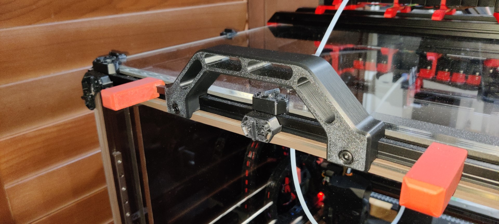

# A 8.5mm version of Jeoje's excellent sturdy handles for my Voron v2
Replaced my panels with 6mm thick Acrylic versions and this meant that the existing [`Sturdy Handles by Jeoje'](https://github.com/VoronDesign/VoronUsers/tree/master/printer_mods/jeoje/Sturdy_Handles) didn't fit anymore :-(

So, modified them from 6mm be 8.5mm which in turn allows clearance for 6mm panels.

# Models
Look in the [CAD](CAD/) and [STL](STL/) folders for the Fusion360 design and the resulting STL model.

# Build
Followed the original repo's guide.
Printed in ABS with higher infill than usual, for strength.

# Attribution
This is not a fork or modification of `Joeje`'s excellent Sturdy Handles MOD. It's just an additional set of CAD & STL models clearing 6mm panels

All credit goes to `Joeje` and his repo over at https://github.com/VoronDesign/VoronUsers/tree/master/printer_mods/jeoje/Sturdy_Handles
